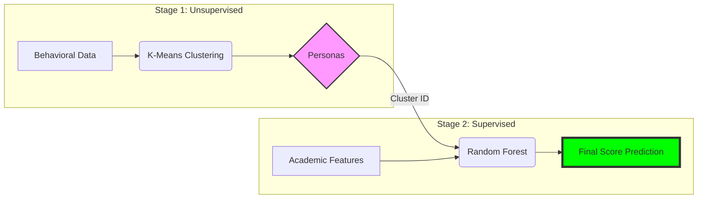
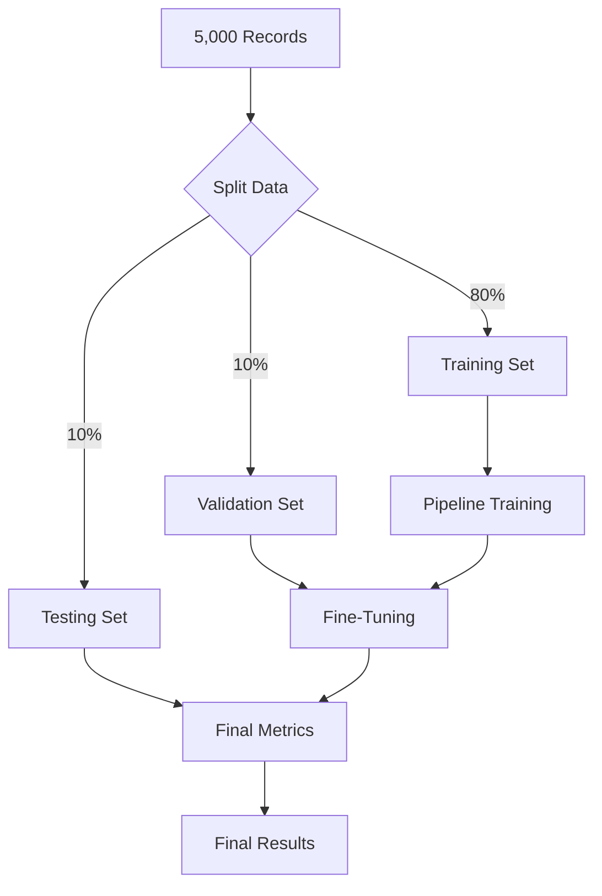

# ML Final Project: Student Performance Prediction

## 1. Introduction/Background

In the modern educational landscape, the proliferation of digital learning platforms and digitized administrative records has led to an explosion of student-related data. However, traditional academic assessment remains largely "reactive"—relying on mid-term or final exam results to evaluate performance when it may already be too late for intervention.

**Educational Data Mining (EDM)** and **Learning Analytics (LA)** have emerged as critical fields that leverage machine learning to transform this raw data into actionable insights. By analyzing behavioral signals—such as attendance consistency, engagement, and study patterns—we can move beyond simple grade tracking.

The background of this project lies in the transition from **static performance monitoring** to **dynamic behavioral analysis**. By identifying latent learning "personas" through unsupervised clustering, we can better understand the diverse strategies students employ and how these strategies correlate with final academic success.

---

## 2. Problem Overview

Despite having access to rich behavioral data (attendance, submission rates, study hours, etc.), educational institutions face several key challenges in optimizing student outcomes:

1.  **Behavioral Invisible Patterns:** Students with similar grades may have vastly different learning behaviors. A "high-performer" who crams at the last minute faces different risks than a "consistent-performer" who attends every lecture.
2.  **The Prediction Lag:** Final exam scores are "trailing indicators." Without early-stage behavioral insights, educators cannot identify students who are statistically likely to underperform *before* the exam occurs.
3.  **Feature Synergy:** It is unclear how specific behavioral combinations—such as high self-study hours paired with low attendance—interact to influence final exam scores across different student clusters.

**Project Objective**

This project aims to bridge the gap between unsupervised pattern discovery and supervised outcome prediction. We will design a two-stage machine learning pipeline that first **identifies student behavioral clusters** (Unsupervised Stage) and then **predicts final exam performance** (Supervised Stage) by incorporating these discovered behavioral context as a meta-feature.

---

## 3. Dataset (Chosen: Student Performance & Behavior)

For this project, we are using the **Student Performance & Behavior Dataset** (5,000 records), which provides a rich set of behavioral and academic attributes.

### How this Data Works in our Pipeline

Our Two-Stage Pipeline will process this data by selecting a subset of **Behavioral Features** to create student clusters, which then act as "Contextual Labels" for the final prediction.

*   **Behavioral Inputs (Stage 1):** `Attendance (%)`, `Study_Hours_per_Week`, `Participation_Score`, `Assignments_Avg`, `Quizzes_Avg`, `Sleep_Hours_per_Night`, and `Stress_Level (1-10)`.
*   **Contextual Inputs (Stage 2):** `Age`, `Department`, `Parent_Education_Level`, and `Extracurricular_Activities`.
*   **The "Secret Sauce":** The output of Stage 1 (Cluster ID) is added to the Stage 2 inputs, allowing the model to understand *how* a student's behavior (e.g., high stress vs. high study hours) influences their `Final_Score`.

**Presentation Idea (How it Works):**
> [!TIP]
> **Infographic Idea:** Use a "Funnel" diagram. The wide top takes in all 24 columns, the middle (Clustering) groups them into 3-4 "Personas", and the narrow bottom predicts the `Final_Score`.

### Data Splitting Strategy

To train and validate our model effectively, we split the 5,000 records as follows:

1.  **Split Ratio:**
    *   **80% Training Set (4,000 records):** Used to "teach" the model the relationship between behaviors and scores.
    *   **10% Validation Set (500 records):** Used to fine-tune the model and check for overfitting during training.
    *   **10% Testing Set (500 records):** Used to evaluate the final model on completely "unseen" data.

2.  **Feature Selection ($X$):**
    *   **Keep:** Features like `Attendance (%)`, `Midterm_Score`, `Assignments_Avg`, `Quizzes_Avg`, `Participation_Score`, `Projects_Score`, `Study_Hours_per_Week`, etc.
    *   **Drop:** Identifiers like `Student_ID`, `First_Name`, `Last_Name`, and `Email`.
3.  **Target Variable ($y$):** `Final_Score`.

**Presentation Idea (Splitting):**

> [!TIP]
> **Infographic Idea:** A large pie chart or modern progress bar showing 80% (Training - "The Learning Phase"), 10% (Validation - "The Fine-Tuning Phase"), and 10% (Testing - "The Final Exam"). Use color coding: Blue for Train, Teal for Val, and Orange for Test.
> 
> 
> 
> 

### Preprocessing

### Model Validation (The "Safety Check")

To ensure our model doesn't just "memorize" the training data (Overfitting), we use **K-Fold Cross-Validation**:

*   **Process:** We divide the 80% Training Set into 5 smaller pieces (Folds).
*   **Action:** We train on 4 pieces and "validate" on 1. We repeat this 5 times.
*   **Result:** This ensures our accuracy isn't just a "lucky guess" on a specific set of students.

**Presentation Idea (Validation):**

> [!TIP]
> **Infographic Idea:** Show a "Circular Cycle" icon with the number "5". Label it "5-Fold Cross-Validation: Testing the model 5 times for stability." 
> 
> 

---

## 4. Proposed Method: The Two-Stage Pipeline

To avoid "long text," this slide should be purely visual. Use the following **Three-Box Architecture**:

### Stage 1: The "Identity" Layer (Unsupervised)
*   **Input:** Behavioral Metrics (Attendance, Study Hours, Stress).
*   **Action:** K-Means Clustering.
*   **Outcome:** Student Personas (e.g., "Highly Engaged" vs. "At-Risk").

### Stage 2: The "Prediction" Layer (Supervised)
*   **Input:** Stage 1 Persona + Original Academic Features.
*   **Action:** Random Forest Regressor.
*   **Outcome:** Final Exam Score Prediction.

**Slide Visual Layout:**
> [!TIP]
> **Infographic Idea:** Draw two large blocks connected by an arrow. 
> *   **Block A (Left):** "Clustering Node" (Target: Discovery).
> *   **Arrow:** Carries the "Cluster ID".
> *   **Block B (Right):** "Prediction Node" (Target: Performance).

---

## 5. Evaluation Protocol

To ensure the reliability and accuracy of our pipeline, we employ separate evaluation metrics for each stage.

### Clustering Evaluation (Stage 1)

*   **Elbow Method:** To determine the optimal number of clusters ($k$).
*   **Silhouette Score:** To measure how well-defined and separated the clusters are (range -1 to 1).

### Prediction Evaluation (Stage 2)

*   **Root Mean Squared Error (RMSE):** To penalize larger errors in score prediction.
*   **Mean Absolute Error (MAE):** To understand the average magnitude of the prediction error in "grade points."
*   **R-Squared ($R^2$):** To measure the proportion of variance in exam scores explained by our behavioral features and clusters.

---

## 7. Diagram Code (For Infographics)

Copy and paste the code below into the [Mermaid Live Editor](https://mermaid.live/) to generate high-quality images for your Google Slides.

### A. The Two-Stage Pipeline (Proposed Model)
This diagram shows how Stage 1 connects to Stage 2.



### B. Experiment Design (Workflow)
This shows how you split and move the data.



---

## 8. How to use these in Google Slides

1.  **Copy the Code:** Highlight the blocks above (starting with `graph LR` or `graph TD`).
2.  **Go to Mermaid Live:** Open [Mermaid.live](https://mermaid.live/).
3.  **Paste:** Replace the left-side text with the code you copied.
4.  **Download:** Click **Actions** > **Download PNG** or **SVG**.
5.  **Insert:** In Google Slides, go to `Insert > Image > Upload from computer`.

> [!IMPORTANT]
> **Pro Tip:** If you want matching colors for your presentation, you can change the `fill:#...` hex codes in the diagram code before downloading!
## 6. Conclusion

### Limitations

*   **Data Bias:** The model assumes behavioral patterns remain consistent over time, which may not account for sudden life events affecting a student.
*   **Feature Completeness:** Behavioral data doesn't capture qualitative factors like student mental health or the difficulty level of specific course modules.

### Scope & Future Work

*   **Real-time Alerts:** Implementing this pipeline into an LMS to provide real-time "at-risk" alerts to professors.
*   **Feature Expansion:** Incorporating sentiment analysis from discussion forums or LMS interaction logs for even deeper behavioral profiling.

---

## 7. Presentation Ideas (For Google Slides Infographics)

Since your instructions require **infographics and diagrams** with no long text, here is how you can visualize the above:

### For Introduction/Background:

*   **The "Reactive vs. Proactive" Diagram:** Use two parallel timelines.
    *   **Timeline A (Traditional):** Shows steps like "Start Semester" -> "Attend Classes" -> "Take Final Exam" -> "Receive Low Grade (Too late!)".
    *   **Timeline B (Proposed ML):** Shows "Behavioral Tracking" -> "Clustering (Early Warning)" -> "Targeted Intervention" -> "Improved Final Performance".
*   **Data Funnel Graphic:** An icon-based funnel showing "Attendance", "Study Hours", and "Submissions" flowing into a "Behavioral Analytics Engine".

### For Problem Overview:

*   **The "Iceberg" Model:**
    *   **Tip of the Iceberg:** "Final Grade" (Visible).
    *   **Underwater (Hidden):** "Attendance", "Self-Study", "Assignment Engagement", "Learning Consistency". This visualizes that behaviors are the hidden driver of the visible result.
*   **Comparison Matrix:** Simple icons comparing two "Student Personas" with the same attendance but different study hours, showing how they end up in different performance clusters.

### For Dataset:

*   **Feature Icon Grid:** Use four large icons (e.g., a calendar for Attendance, a folder for Assignments, a clock for Study Hours, and a checklist for Quizzes) with brief 2-3 word labels.
*   **A "Fake" Data Snippet Table:** A clean, colorful table showing 3-5 rows of sample data to give the audience a concrete "look" at the inputs.
*   **Correlation Heatmap (Visual):** A stylized heatmap showing high/low correlation between features and the final score.

### For Proposed Method:

*   **The Two-Block Pipeline:**
    *   **Block 1 (Clustering):** Input icons -> [K-Means Gear] -> Cluster Label (Color-coded).
    *   **Block 2 (Prediction):** [Input icons + Cluster Label] -> [Random Forest Tree] -> Predicted Score.
*   **"Persona" Cards:** Small cards showing "The High-Achiever" (Green), "The Struggler" (Red), and "The Average" (Yellow) with brief behavior bullets.

### For Evaluation Protocol:

*   **Metric Scorecards:** Large, bold percentage/number placeholders (e.g., "$R^2$: 0.85", "RMSE: 5.2") next to short 1-sentence explanations.
*   **Silhouette Plot Sketch:** A simple stylized graph showing high vs. low silhouette scores to show "Good" vs "Bad" clustering.

---

## 9. Final Slide Text (Copy-Paste Ready)

To follow the **"No Long Text"** rule, use these exact bullets for your remaining slides:

### Slide 9: Experiment Design
*   **Dataset:** 5,000 Records (Kaggle).
*   **Split:** 80% (Train) / 10% (Val) / 10% (Test).
*   **Workflow:** Data -> Split -> Train -> Tune -> Final Proof.
*   *Visual:* [Insert Mermaid Diagram B]

### Slide 10: Evaluation Protocols (The Yardstick)
*   **Clustering (Stage 1):**
    *   *Silhouette Score:* "How clear are the groups?"
    *   *Elbow Method:* "Is this the right number of groups?"
*   **Prediction (Stage 2):**
    *   *RMSE/MAE:* "Average points error (±5)."
    *   *R-Squared:* "Accuracy score."

### Slide 11: Conclusion & Future Roadmap
*   **Summary:** Behavior reveals what grades hide.
*   **Limitations:** Student behavior can change; doesn't track mental health.
*   **Next Steps:** 
    *   Real-time "At-Risk" alerts.
    *   LMS Integration.
    *   Sentiment Analysis.

---

## 10. Technical Implementation (Python)

If you need to show the code logic in your project or slides, use these simplified snippets:

### Stage 1: K-Means Clustering (Persona Discovery)
```python
from sklearn.cluster import KMeans
from sklearn.preprocessing import StandardScaler

# 1. Select & Scale Behavioral Data
beh_cols = ['Attendance (%)', 'Study_Hours_per_Week', 'Stress_Level (1-10)']
scaler = StandardScaler()
X_train_scaled = scaler.fit_transform(X_train[beh_cols])

# 2. Identify 3 Student Personas
kmeans = KMeans(n_clusters=3, random_state=42)
X_train['Cluster_ID'] = kmeans.fit_predict(X_train_scaled)
```

### Stage 2: Random Forest (Performance Prediction)
```python
from sklearn.ensemble import RandomForestRegressor

# 1. Combine Original Features + Cluster_ID
# 2. Train the Regressor
rf = RandomForestRegressor(n_estimators=100, random_state=42)
rf.fit(X_train_processed, y_train)

# 3. Predict Final Score
predictions = rf.predict(X_test_processed)
```
