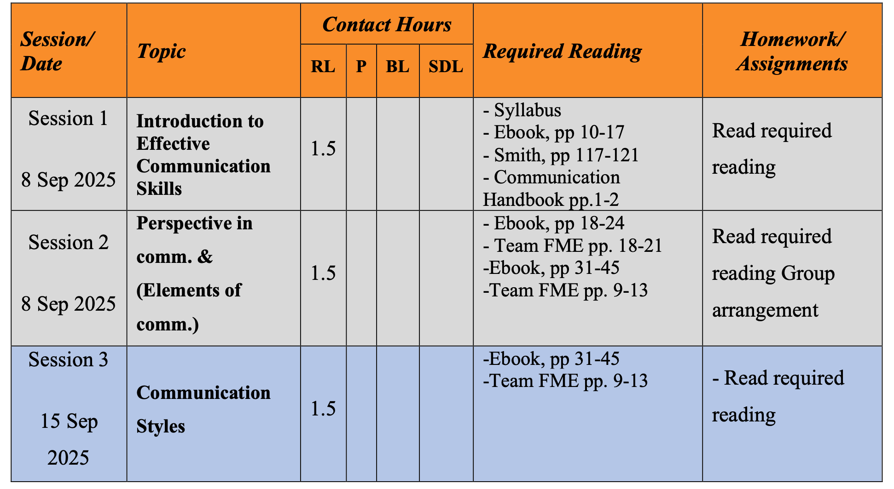

## What is the communication?

⇒ Communication is the act or process of using words, sound, or body language to exchange ideas or information.

- Soft Skills has 3 sessions

- A message can be a word or an Image

## Commutation Strategy

A **communication strategy** is **a detailed plan for effectively conveying messages to a specific audience to achieve organizational goals**. It involves defining the **message** itself—what needs to be communicated—and how it will be crafted to resonate with the audience. The **method** or **approach** refers to the channels and tactics used to deliver the message, such as social media, email, or print materials. These elements work together to ensure clarity, consistency, and alignment with overarching business objectives.

**Communication Strategy** is the high-level plan that guides all communication efforts. It answers key questions, such as:

- **What** are we trying to achieve with this communication?
- **Who** is our target audience?
- **What** is the core message we need to convey?
- **How** will we deliver this message?
- **When** and how often will we communicate?

**The message** is the actual content that needs to be delivered to stakeholders.

- **Content:** The specific information, idea, or value you want to convey.
- **Clarity:** The message should be easy to understand, avoiding confusion.
- **Consistency:** The message should remain the same across different communications to prevent mixed signals.
- **Alignment:** The message must support the organization's overall goals and vision.

**Method/Approach**: This refers to the specific actions and tools used to get the message to the audience.

- **Channels:** The platforms or mediums used, such as social media, email, newsletters, print, or internal meetings.
- **Tactics:** The specific techniques employed, like visual aids, non-verbal communication, or public relations efforts.
- **Frequency:** The schedule for delivering messages to ensure they are timely and engaging.
- **Engagement:** The method should aim to foster interaction and connection with the audience.

## Barriers in Communication

Here is the Material for soft skills

[1. Ebook effective-communication-skills.pdf](../Lessons/1.%20Ebook%20%20effective-communication-skills.pdf)
[2. Smith-Using Effective Communication.pdf](../Lessons/2.%20Smith-Using%20Effective%20Communication.pdf)
[3. Doing2learn_Communication_Handbook.pdf](../Lessons/3.%20Doing2learn_Communication_Handbook.pdf)
[4. Team fme-effective-communication.pdf](../Lessons/4.%20Team%20fme-effective-communication.pdf)